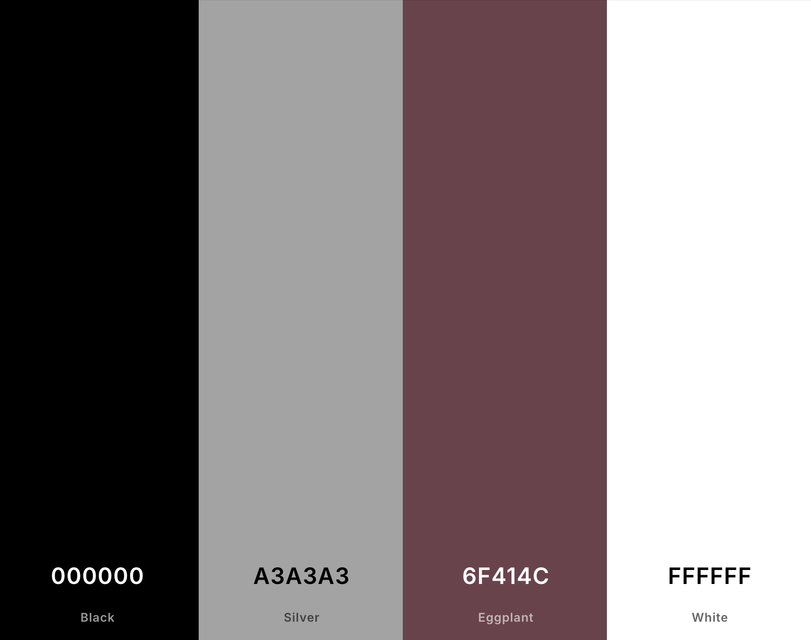

# Bake Boutique


[View The Live Project Here](https://my-project4-bake-boutique-8d47b339b2ab.herokuapp.com/) <!-- Add link to live site here -->

## Purpose of the Project

Bake Boutique is an e-commerce platform designed to provide users with a seamless experience for browsing, customizing, and purchasing baked goods for all occasions. It offers a wide selection of cakes, cupcakes and cookies while allowing users to customize their orders to suit their preferences.

## Table Of Contents
1. [Introduction](#Introduction)
    1. [Scenario](#Scenario)
2. [UX](#UX)
    1. [User Stories](#User-Stories)
    2. [Design Thinking](#Design-Thinking)
    3. [Colour Scheme](#Colour-Scheme)
    4. [Content Planning](#Content-Planning)
3. [Design](#Design)
    1. [Wireframes](#Wireframes)
4. [Features](#Features)
    1. [Design Features](#Design-Features)
    2. [Existing Features](#Existing-Features)
       1. [Public User Features](Public-User-Features)
       2. [Private User Features](Private-User-Features)
       3. [Admin/Staff Features](Admin/Staff-Features)
    3. [Future Adaptations](#Future-Adaptations)
5. [Technologies Used](#Technologies-Used)
    1. [Main Languages Used](#Main-Languages-Used)
    2. [Frameworks, Libraries & Programs Used](#Frameworks,-Libraries-&-Programs-Used)
6. [Database Design](#Database_Design)
7. [Testing](#Testing)
8. [Issues and Bugs](#Issues-and-Bugs)
9. [Deployment](#Deployment)
10. [Credits](#Credits)
11. [Acknowledgements](#Acknowledgements)

---
## Introduction
Bake Boutique

Welcome to Bake Boutique! An e-commerce platform where users can discover, customise, and purchase exquisite baked goods for every occasion.

### Scenario

In today’s fast-paced world, finding the perfect baked treat for celebrations, events, or personal indulgence has never been more convenient. Bake Boutique bridges the gap between traditional bakeries and online shopping, offering a wide range of cakes, cupcakes, and cookies to delight every customer.

Consider Bake Boutique as the ultimate destination for those who value the art of baking and enjoy the luxury of customising their orders to suit their unique needs. Whether you're planning a wedding, a birthday celebration, or simply craving a sweet treat, Bake Boutique makes the process seamless and enjoyable.

Bake Boutique’s user-friendly platform allows customers to browse a curated selection of baked goods, view detailed product descriptions, and place orders with ease. Registered users can access additional features such as wishlists cakes and other products.

In a world where time is precious, Bake Boutique offers the convenience of exploring, selecting, and purchasing baked goods online, all from the comfort of your home. Whether you're looking for a simple dessert or an elaborate centerpiece for your special event, Bake Boutique provides a delightful shopping experience for every occasion. 

With this vision in mind, let’s explore Bake Boutique together!

## UX
### User Stories

Bake Boutique serves three types of users: the site owner (admin), public users, and private users (registered and signed-in users). The following user stories were considered during development:

#### General Features:
- As a public user, I want to browse the available baked goods without needing to sign up so that I can quickly explore the platform and see what is offered.
- As a public user, I want to view product details, such as pricing and description.

#### Registration and User Accounts:
- As a site user, I want to easily register for an account so that I can have a personalised experience.
- As a site user, I want to log in and out effortlessly so that I can manage my account access.
- As a site user, I want to receive an email confirmation after registering so that I can verify my account registration was successful.

#### Sorting and Searching:
- As a shopper, I want to sort products by categories so that I can easily identify the best-rated or priced options.
- As a shopper, I want to search for a specific product by name or description so that I can quickly find what I am looking for.

#### Purchasing and Checkout:
- As a shopper, I want to select the size and quantity of a product so that I can customise my order before purchasing.
- As a shopper, I want to adjust the quantity of items in my bag so that I can make changes before checkout.
- As a shopper, I want to easily enter my payment information so that the checkout process is quick and secure.
- As a shopper, I want to receive an email confirmation after checkout so that I can keep a record of my purchase.

#### Wishlist Features:
- As a registered user, I want to add products to my wishlist so that I can save them for future purchases.
- As a registered user, I want to view and manage my wishlist so that I can easily purchase or remove items.
- As a public user, I want to be encouraged to sign up by not having access to the wishlist feature.

#### Reviews:
- As a registered user, I want to leave reviews on products so that I can share feedback with others.
- As a visitor, I want to view product reviews so that I can make informed decisions before purchasing.
- As a site owner, I want to moderate reviews so that only appropriate content is displayed.

#### Testimonial Page:
- As a user, I want to submit testimonials after contacting Bake Boutique so that I can share my experiences.
- As a visitor, I want to read testimonials so that I can learn about other customers’ experiences.
- As a site owner, I want to approve testimonials before displaying them so that only genuine ones are shown.

#### Admin and Store Management:
- As a store owner, I want to add products to my inventory so that I can expand the store’s offerings.
- As a store owner, I want to edit or update product details so that I can keep information accurate and current.
- As a store owner, I want to delete products that are no longer available so that my store remains up-to-date.

All detailed user stories can be found in a linked GitHub project [here](https://github.com/users/Tenda-M/projects/6/views/1).


### Design Thinking

- **User-Friendly Interface**: Bake Boutique is designed to ensure smooth navigation and intuitive usability.
- **Mobile-First Design**: The platform is fully responsive, offering an optimized experience across devices.
- **Warm and Welcoming**: The platform's color scheme and visual elements create an inviting experience for users.

### Colour Scheme

A warm palette inspired by baked goods was selected. Soft tones combined with bold accents create a visually appealing aesthetic that resonates with the theme of a bakery.


I used [coolors.co](https://coolors.co/000000-333333-ffffff-d2691e-e67e22-c15418-d35400-263e21) to generate my colour palette.




### Content Planning for Bake Boutique
#### Meeting User Needs
Bake Boutique is designed to provide a seamless and engaging experience for users who want to browse, customise, and purchase baked goods online. The website caters to different types of users, including:  

- **Casual Visitors** looking for visually appealing and easy-to-navigate product pages.  
- **Returning Customers** who want a quick reordering experience.  
- **New Customers** who need trust signals, such as reviews, clear product descriptions, and secure checkout options.  

The homepage and key pages are structured to address these needs by offering:  

- **Intuitive Navigation** – Users can easily explore cakes, cupcakes, and cookies.  
- **Detailed Product Descriptions** – Every item has high-quality images, pricing, and customisation options.  
- **Seamless Checkout Process** – A smooth, multi-step order process ensures a frustration-free experience.  
- **Mobile-Friendly Design** – Optimised for different devices to enhance accessibility.  

---

#### Providing Key Information and Features
To ensure users can find what they need quickly, Bake Boutique provides:  

- **High-Quality Product Images** – Showcasing baked goods in an appealing way.  
- **Clear Descriptions** – Including ingredients, customisation options, and prices.  
- **Customer Testimonials** – Displaying reviews to establish trust and credibility.  
- **Search & Filter Options** – Helping users find specific products quickly.  
- **Secure Payment Processing** – Offering multiple payment options for convenience.  

---

#### Making Information Easy to Understand
Bake Boutique ensures clarity in content by:  

- **Simple & Concise Language** – Avoiding unnecessary jargon to improve readability.  
- **Clear Call-to-Actions (CTAs)** – Buttons and links guide users towards making a purchase or signing up.  

---

#### Demonstrating Expertise & Trustworthiness  
To establish Bake Boutique as a reliable brand:  

- **Secure Payment & Privacy Policies** assure safe transactions.  
- **About Page** shares Bake Boutique’s story and expertise in baking.  

---

### SEO & User Engagement Improvements
To enhance user discovery and search engine ranking:  

- **Keyword Optimisation:** Using relevant baking-related keywords.  
- **Social Media Integration:** Encouraging shares and customer engagement.  
- **Email Subscription Options:** Allowing users to receive updates and promotions.  

#### Conclusion
- By focusing on user needs, content clarity, trust signals, and SEO strategies, Bake Boutique ensures a high-quality browsing and shopping experience. This approach not only enhances customer satisfaction but also improves the site's visibility in search engines.  
---
## Design

-   ### Wireframes

    The wireframe diagrams below describe the application web pages.  

    <details>
    <summary>Desktop Wireframes</summary>

    
    </details>
    <details>
    <summary>Tablet Wireframes</summary>

    
    </details>
    <details>
    <summary>Smartphone Wireframes</summary>

    
    </details>

---

## Features

### Design Features
- A modern, responsive design that adapts to various screen sizes.
- Flexbox-based layout for product cards ensuring consistent alignment.
- Interactive navigation, including a dropdown menu for FAQ and About sections.

---

### Existing Features

#### Public User Features

- **Homepage**
  - The homepage prominently displays products such as cakes, cookies, and cupcakes. Each product card includes an image, product title, description, and price, arranged in a grid layout for easy browsing.
  - The "Shop Now" button allows users to navigate directly to the product categories.

  

- **About Us Page**
  - The About page features a welcoming message from the Bake Boutique team, explaining the mission and vision of the platform. It provides an overview of the brand’s dedication to quality and customer satisfaction.
  - The design is simple, with warm colours and inviting text to engage users.

  

- **Contact Page**
  - The Contact Us page provides a clean and simple contact form, allowing users to reach out with questions, feedback, or suggestions. The form includes fields for Name, Email, and Message, ensuring clear communication.
  - A prominent "Submit" button is available for users to send their messages directly to the team.

  

- **Register Page**
  - The Register page enables users to create an account by filling out fields for Username, Email, and Password. A "Sign Up" button is clearly visible, and links are available for users who need to log in.

  

- **Login Page**
  - The Login page provides a simple form for users to sign in using their Username and Password. Users can also select "Remember Me" to stay logged in, and there are links to register or reset the password for easy navigation.

  

- **Product Details Page**
  - Each product has a detailed page displaying its description, available sizes, and price. Users can select quantity and size options before adding items to their bag.

  

  - **Testimonial Page**
  - Public users can not submit testimonials. Testimonials are displayed after admin approval, showcasing genuine feedback from customers.
  

- **Category Pages**
  - **Cakes Page**: Displays all available cakes with their descriptions and pricing.
  

  - **Cookies Page**: Lists all cookies with details about flavour and pricing.
  

  - **Cupcakes Page**: Features available cupcakes with options for customisation.
  
---

#### Private User Features

- **Testimonial Page**
  - Logged-in users can submit testimonials about their experience with Bake Boutique. Testimonials are displayed after admin approval, showcasing genuine feedback from customers.

  

- **Review Section**
  - Logged-in users can leave reviews on individual product pages. Each review includes a rating and a comment section, allowing customers to provide detailed feedback.

  

- **Wishlist Page**
  - Registered users can save products to their wishlist for future purchases. The wishlist displays all saved items with their images and pricing, and users can easily remove items or move them to the shopping bag.

  

- **Profile Page**
  - The Profile page allows users to view and manage their account details. Users can see their saved wishlist, past orders, and account settings.
  - The page is organised with tabs for easy navigation.

  

---

#### Admin Features

- **Edit Review Page**
  - Admins can edit user reviews for clarity or compliance with site guidelines.
  

- **Delete Review Page**
  - Admins can delete inappropriate or irrelevant reviews.
  

- **Edit Testimonial Page**
  - Admins have the option to edit submitted testimonials for accuracy.
  

- **Delete Testimonial Page**
  - Admins can remove testimonials that do not align with Bake Boutique’s policies.
  

- **Product Management**
  - Admins can add, edit, and delete products from the inventory to keep the store updated.
  

#### Notifications

- ***Login Notification***
  Displays a toast notification when a user logs in successfully.
  

- ***Logout Notification***
  Shows a confirmation notification when a user logs out.
  

- ***Order Confirmation Notification***
  Notifies the user that their order has been successfully placed.
  

- ***Testimonial Submission Notification***
  Confirms that a testimonial has been successfully submitted.
  

- ***Edit Testimonial Notification***
  Alerts users when their testimonial has been successfully edited.
  

- ***Delete Testimonial Notification***
  Notifies users when their testimonial has been successfully deleted.
  

#### Reviews
- ***Edit Review***
  Allows users to modify their previously submitted reviews.
  

- ***Delete Review***
  Enables users to delete reviews they no longer want to display.
  

#### Wishlist
The wishlist feature allows registered users to save products they are interested in for later. This feature is private and only visible to the logged-in user.

- ***Add to Wishlist***
  Users can add products to their wishlist for future purchases.  
  

- ***Remove from Wishlist***
  Users can remove items from their wishlist if they no longer wish to save them.  
  

---

### Future Features
### Future Adaptations
#### Future Features for Bake Boutique

- **Product Rating System**: Future development will include a feature where users can rate products, helping others identify the most popular or highly-rated baked goods.

    - Private users will be able to rate products using a likes or star-rating system.
    - Each product will display the average rating, calculated from all submitted user ratings.
    - Users will only be allowed to rate a product once but can update their rating if necessary.
    - The most highly-rated products will be featured in a "Top Picks" or "Customer Favourites" section.

- **Advanced Product Search**: Users will gain the ability to search for products using advanced filters such as flavour, dietary restrictions, or special occasions.

    - Filters will include options such as flavour (e.g., chocolate, vanilla), dietary restrictions (e.g., vegan, gluten-free), or product type (e.g., birthday cakes, cupcakes, cookies).
    - Products will be dynamically displayed based on the selected filters, updating the results without needing a full page reload.
    - Users will be able to apply multiple filters simultaneously to refine their search results (e.g., vegan + chocolate cakes).
    - A search results counter will display the number of products matching the selected filters.

- **Social Media Product Sharing**: A future feature will allow users to share their favourite products directly on social media platforms, helping expand Bake Boutique's reach and engagement.

    - Private users will be able to share products on platforms like Facebook, Instagram, and Twitter with a single click.
    - Each product page will include share buttons that generate a unique URL and preview for the social media platform.
    - Users will receive notifications confirming their successful social media sharing.
    - Products shared on social media will display the number of shares, showcasing their popularity.

---


## Technologies Used
- [HTML](https://en.wikipedia.org/wiki/HTML) is used to structure the main content of the site.
- [CSS](https://en.wikipedia.org/wiki/CSS) is used for designing the layout and appearance of the website.
- [CSS Flexbox](https://www.w3schools.com/css/css3_flexbox.asp) is implemented for a responsive layout that adapts to different screen sizes.
- [CSS Grid](https://www.w3schools.com/css/css_grid.asp) is also used for creating flexible, responsive layouts.
- [JavaScript](https://www.javascript.com) is used to enhance user interaction and dynamic elements on the site.
- [Python](https://www.python.org) is used as the back-end programming language, handling server-side functionality.
- [Git](https://git-scm.com) is used for version control, allowing me to track and manage changes (`git add`, `git commit`, `git push`).
- [GitHub](https://github.com) is used for secure online storage of the project code and for collaboration.
- [Gitpod](https://gitpod.io) is the cloud-based integrated development environment (IDE) used for writing and testing code.
- [Bootstrap](https://getbootstrap.com) is used to create a responsive front-end design with pre-built components and styling.
- [Django](https://www.djangoproject.com) is the Python framework used to develop the back-end of the site and manage its functionalities.
- [PostgreSQL](https://www.postgresql.org) is used as the relational database to store data such as user information.
- [ElephantSQL](https://www.elephantsql.com) is used to host the PostgreSQL database for production.
- [Heroku](https://www.heroku.com) is the hosting platform used to deploy and run the live site.
- [amazon s3](https://aws.amazon.com/pm/serv-s3/?gclid=EAIaIQobChMI_6THvsfyigMV9JRQBh3V8RtbEAAYASAAEgIJJ_D_BwE&trk=777b3ec4-de01-41fb-aa63-cde3d034a89e&sc_channel=ps&ef_id=EAIaIQobChMI_6THvsfyigMV9JRQBh3V8RtbEAAYASAAEgIJJ_D_BwE:G:s&s_kwcid=AL!4422!3!638364429346!e!!g!!amazon%20s3!19096959014!142655567183) is used for managing and hosting static files and images for the site.

### Main Languages Used
- HTML, CSS, JavaScript for frontend development.
- Python (Django) for backend logic.
- SQL (PostgreSQL/MySQL) for database management.

### Frameworks, Libraries & Programs Used
- Django for backend web development.
- Bootstrap for responsive design and layout.
- Amazon s3 for image storage.

## Database Design
- While planning this project, I drew up an Entity Relationship Diagram to help me visualise the database models and their relationships.


## Testing
Manual testing was conducted for all key features, including product addition, editing products, and testimonial functionality. This testing ensures that all components work seamlessly across various devices and browsers.

For comprehensive details on the testing process, please refer to the [TESTING.md](documentation/TESTING.md) file.


## Issues and Bugs
- Resolved issues with contact us form submission.
- Adjusted layout for consistent display of testimonial cards.
- Ongoing improvements for mobile responsiveness.

## Deployment
- The application was deployed using Heroku, and the database was configured with PostgreSQL.

The following steps for creating and configuring a new Python workspace and API credentials have been informed by and adapted from the walkthrough project by [Code Institute's](https://codeinstitute.net/ie/). Please ensure each step is applicable to my project requirements and adjust the provided data accordingly.

### Creating a new repository 
<details open>
<summary>Steps to create a new repository.</summary>  
The [Code Institute's Python Essential Template](https://github.com/Code-Institute-Org/python-essentials-template) was used to create a terminal for my Python file to generate it's output. 

To utilise this template, adhere to these steps:
1. Sign in to [GitHub](https://github.com/) or register for a new account.
2. Go to the Python template repository provided above.
3. Select '**Use this template**' -> '**Create a new repository**'.
4. Pick a new repository name and choose '**Create repository from template**'.
5. Within your new repository area, click the green '**Gitpod**' button to create a new workspace.

</details> 

#### Deploying to Heroku 
The Bake Boutique project was deployed using [Heroku](https://www.heroku.com) and connected to an external PostgreSQL database hosted on [ElephantSQL](https://www.elephantsql.com). Below is a step-by-step guide to the deployment process:

##### Steps for Deployment:

1. **Set Up the Project Locally**:
   - Ensure that your project is properly set up and working locally before deploying. Install all necessary dependencies listed in `requirements.txt` using the following command:
     ```bash
     pip install -r requirements.txt
     ```

2. **Set Up Heroku**:
   - Log in to your [Heroku](https://dashboard.heroku.com) account.
   - Create a new Heroku app by clicking **New** > **Create New App**.
   - Choose a unique app name and select the region closest to your location.

3. **Set Up PostgreSQL**:
   - In Heroku, go to the **Resources** tab of your app.
   - Under **Add-ons**, search for and add **Heroku Postgres** as your database.
   - Alternatively, use [ElephantSQL](https://www.elephantsql.com) for your PostgreSQL database by creating an instance on ElephantSQL and copying the database URL.
   - In your Heroku app, navigate to **Settings** > **Reveal Config Vars** and set the following environment variables:
     - `DATABASE_URL`: Your PostgreSQL database URL (from either Heroku Postgres or ElephantSQL).
     - `SECRET_KEY`: A secret key for your Django project.
     - `DEBUG`: Set to `False` for production.

4. **et Up Amazon S3 for Static and Media Files**:

  1. ***Set Up an Amazon S3 Bucket***:
    - Log in to your [AWS Management Console](https://aws.amazon.com/console/) and navigate to the S3 service.
    - Create a new S3 bucket:
      - Choose a unique bucket name (e.g., `bake-boutique-static-media`).
      - Select a region close to your location.
    - Configure bucket permissions to allow public access for static files (only if necessary for your use case).

  2. ***Set Up IAM User for Access***:
    - In the AWS Management Console, go to the **IAM** service.
    - Create a new IAM user with programmatic access and attach the policy `AmazonS3FullAccess` (or create a custom policy to restrict access to your specific bucket).
    - Note down the **Access Key ID** and **Secret Access Key**, as they will only be shown once.

  3. ***Add S3 Credentials to Heroku Config Vars***:
    - Log in to your Heroku dashboard.
    - Navigate to your app and go to the **Settings** tab.
    - Under **Config Vars**, add the following variables:
      - `AWS_ACCESS_KEY_ID`: Your IAM Access Key ID.
      - `AWS_SECRET_ACCESS_KEY`: Your IAM Secret Access Key.
      - `AWS_STORAGE_BUCKET_NAME`: The name of your S3 bucket.
      - `AWS_S3_REGION_NAME`: The region of your S3 bucket (e.g., `us-east-1`).
      - `AWS_S3_CUSTOM_DOMAIN`: The S3 URL for your bucket (e.g., `https://<bucket-name>.s3.amazonaws.com`).

  4. ***Update Django Settings***:
    - Install the required dependencies:
      ```bash
      pip install boto3 django-storages
      ```
    - Add `'storages'` to your `INSTALLED_APPS` in `settings.py`.
    - Update `settings.py` to configure S3 as the backend for static and media file storage:
      ```python
      # AWS S3 Settings
      AWS_ACCESS_KEY_ID = os.getenv("AWS_ACCESS_KEY_ID")
      AWS_SECRET_ACCESS_KEY = os.getenv("AWS_SECRET_ACCESS_KEY")
      AWS_STORAGE_BUCKET_NAME = os.getenv("AWS_STORAGE_BUCKET_NAME")
      AWS_S3_REGION_NAME = os.getenv("AWS_S3_REGION_NAME")
      AWS_S3_CUSTOM_DOMAIN = os.getenv("AWS_S3_CUSTOM_DOMAIN")

      # Static and Media File Storage
      STATICFILES_STORAGE = 'storages.backends.s3boto3.S3Boto3Storage'
      DEFAULT_FILE_STORAGE = 'storages.backends.s3boto3.S3Boto3Storage'

      STATIC_URL = f'https://{AWS_S3_CUSTOM_DOMAIN}/static/'
      MEDIA_URL = f'https://{AWS_S3_CUSTOM_DOMAIN}/media/'
      ```

5. **Collect Static Files**:
   - Run the following command to collect all static files and upload them to S3:
     ```bash
     python manage.py collectstatic
     ```

6. **Test the Integration**:
   - Ensure that all static and media files are being served correctly from your S3 bucket.
   - Verify the file uploads and permissions for both static and media assets.


5. **Prepare Your Application for Deployment**:
   - Make sure you have a `Procfile` in the root of your project, specifying how Heroku should run your app:
     ```
     web: gunicorn your_project_name.wsgi
     ```
   - Make migrations for your database:
     ```bash
     python manage.py makemigrations
     python manage.py migrate
     ```
   - Collect static files to be served by amazon s3:
     ```bash
     python manage.py collectstatic
     ```

6. **Deploy to Heroku**:
   - Connect your Heroku app to your GitHub repository under the **Deploy** tab in Heroku.
   - Enable automatic deploys from the `main` branch, or manually deploy by clicking the **Deploy Branch** button.

7. **Run the App**:
   - Once deployed, your app should be live at `https://your-app-name.herokuapp.com`.
   - Use the **Heroku logs** command to troubleshoot any issues:
     ```bash
     heroku logs --tail
     ```

-----  

### Forking the GitHub Repository

A copy of the original repository can be made through GitHub. Please follow the below steps to fork this repository:  

1. Visit GitHub and sign in.
2. After logging in, access this repository using the following link: [Bake Boutique Repository](https://github.com/Tenda-M/Bake-Boutique).
3. Above the file section of the repository and located at the top right of the page, you'll find the '**Fork**' button. Click on it to create a fork of this repository.
4. You should now find a forked version of this repository in your GitHub account.

-----  

### Clone this GitHub Repository

A local clone of this repository can be made on GitHub. Please follow the below steps:
1. Go to GitHub and sign in.
2. You can find the [Bake Boutique Repository](https://github.com/Tenda-M/Bake-Boutique) at this address.
3. Above the section containing repository files, locate the '**Code**' button.
4. Click on it and select your preferred cloning method from HTTPS, SSH, or GitHub CLI. Copy the URL to your clipboard using the '**Copy**' button.
5. Launch your Git Bash Terminal.
6. Navigate to the directory where you want the cloned directory to be created.
7. Enter `git clone` followed by pasting the copied URL from step 4.
8. Hit '**Enter**' to initiate the creation of the local clone.

## Credits
### Content
- Pictues content was provided by pinterest.

- The Code Institute's 'Codestar' project provides guidance for setting up Google Sheets API and Credentials: [Code Institute](https://codeinstitute.net/ie/)

- W3Schools provided helpful Python tutorials. [W3Schools](https://www.w3schools.com/python/default.asp)

- The Python Typing Text Effect us was from. [computing.net](https://www.101computing.net/python-typing-text-effect/)

- Use of alert colour [coolors.co](https://coolors.co/000000-333333-a1a1a1-f5f5f5-ffffff-507e50-507948-304f2a-263e21)

- Use of all images [Vecteezy](https://www.vecteezy.com)

- Used to create wishlist [Python Django Ecommerce Customer Wish List](https://www.youtube.com/watch?v=OgA0TTKAtqQ).

- Used to create reviews [Creating Reviews and Star Rating Feature in Django](https://www.youtube.com/watch?v=UgEVC7oJDHI).

- Used to create testimonials [Code4Startup](https://code4startup.com/lessons/basic-django-create-testimonial-page-714/).

- HTML, CSS, javascript[mdn](https://developer.mozilla.org/en-US/docs/Web/HTML/Element/input/email)

- Use of django urls [django](https://docs.djangoproject.com/en/5.1/ref/urls/)

- Use of profile creation [youtube](https://www.youtube.com/watch?v=FdVuKt_iuSI&list=PL-osiE80TeTtoQCKZ03TU5fNfx2UY6U4p&index=9)

- Use of Bootstrap FAQ Page [bootstrapbrain.com](https://bootstrapbrain.com/component/bootstrap-faq-page-using-accordion/)
  
### People
- Project development and design by [Tatenda Mudehwe].

## Acknowledgements
- I extend my heartfelt gratitude to my family for their unwavering support during discussions on ideas and debugging, as well as for diligently testing my work.
- Special thanks to my mentor, Excellence Ilesanmi, for providing invaluable support and guidance throughout this journey.
- I am deeply thankful to my fellow peers at Code Institute for their invaluable support and camaraderie.